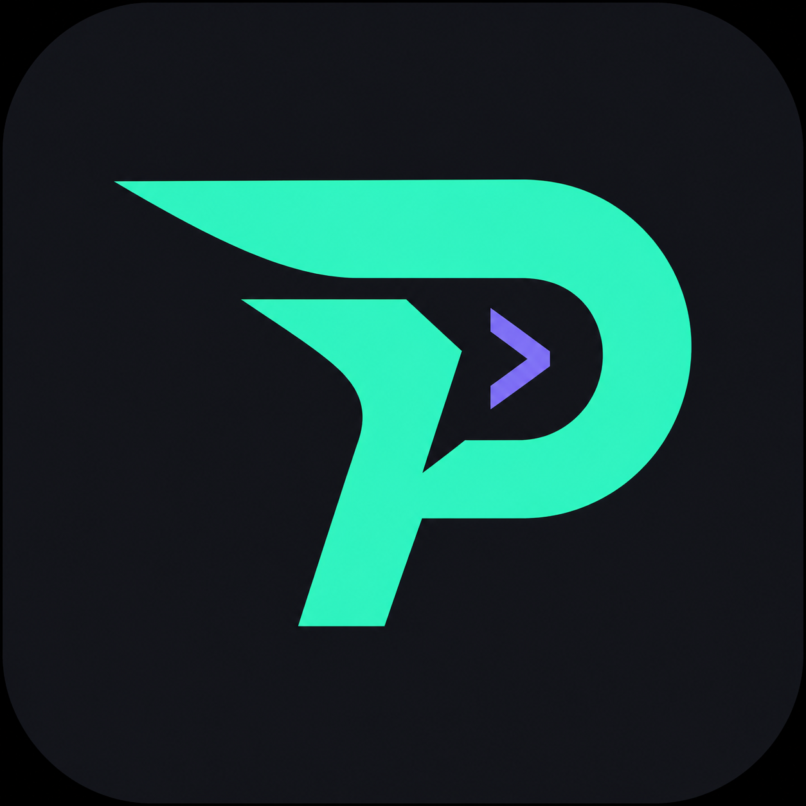
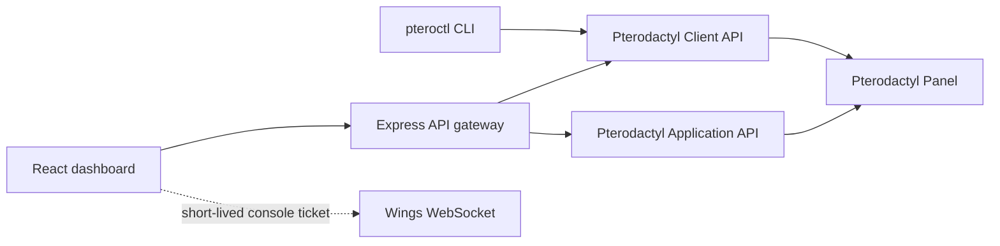

<div align="center">
  
  <h1>PteroControl</h1>
  <p>A secure remote control centre for Pterodactyl Panel.</p>

  [](https://github.com/NekoSuneProjects/PtderactylControl/actions/workflows/desktop-build.yml)
  
  
  
</div>

PteroControl brings server monitoring, console access, file management, backups, deployment, and administrative tools into one responsive interface. Run it as a Windows or Linux desktop app, a Docker-hosted dashboard, or from the `pteroctl` command line.

API credentials remain in the local/server-side gateway and are never embedded in the browser bundle.

## Highlights

| Area | Capabilities |
| --- | --- |
| Monitoring | Running, offline, transitional and error states; CPU, memory, disk, network and uptime |
| Control | Start, stop, restart, kill and console commands |
| Console | Live Wings WebSocket output, follow mode, command history and clear output |
| Files | Directory browser, text file viewing and editing |
| Data | Backup creation/removal, network allocations and activity history |
| Administration | Guided server deployment and Pterodactyl user creation |
| Runtimes | Responsive web app, Electron desktop, Docker and CLI |
| Security | Server-side API keys, signed HTTP-only sessions and production configuration checks |

When credentials are absent, PteroControl starts with a populated demo workspace so you can explore the interface safely.

## Architecture



The Client API powers server operations. The Application API provides administrative catalogues and creation endpoints. PteroControl respects the permissions attached to each supplied key.

## Quick start

Requires Node.js 22 or newer.

```bash
git clone https://github.com/NekoSuneProjects/PtderactylControl.git
cd PtderactylControl
npm install
npm run dev
```

Open `http://localhost:5173`. This launches demo mode until a `.env` file is configured.

## Connect a panel

Copy the example configuration:

```bash
cp .env.example .env
```

On PowerShell:

```powershell
Copy-Item .env.example .env
```

Set these values in `.env`:

```env
PTERODACTYL_URL=https://panel.example.com
PTERODACTYL_CLIENT_API_KEY=ptlc_your_client_key
PTERODACTYL_APPLICATION_API_KEY=ptla_your_application_key
CONTROL_PANEL_PASSWORD=use-a-long-unique-password
SESSION_SECRET=use-at-least-32-random-characters-here
DEMO_MODE=false
```

| Variable | Purpose |
| --- | --- |
| `PTERODACTYL_URL` | Panel origin without a trailing slash |
| `PTERODACTYL_CLIENT_API_KEY` | Power, resources, console, files, backups and networking |
| `PTERODACTYL_APPLICATION_API_KEY` | Administrative listing and server/user creation |
| `CONTROL_PANEL_PASSWORD` | Password protecting the remote dashboard |
| `SESSION_SECRET` | Random value of at least 32 characters used to sign sessions |
| `DEMO_MODE` | Set to `false` to connect to the configured panel |

On Pterodactyl 1.8+, an administrator Client key can access Application endpoints, so the separate Application key can be omitted. An Application-only key cannot call Client endpoints.

## Run modes

### Production web server

```bash
npm run build
npm start
```

Open `http://localhost:8787`.

### Docker

```bash
docker compose up -d --build
docker compose ps
```

The container runs as the unprivileged `node` user and exposes port `8787`. The included health check monitors `/api/health`.

Place the service behind HTTPS when exposing it outside a trusted network.

### Windows and Linux desktop

Run Electron locally:

```bash
npm run desktop
```

Build native packages for the current operating system:

```bash
npm run desktop:dist
```

- Windows: NSIS installer
- Windows portable: `npm run desktop:portable`
- Linux: AppImage and Debian package
- Output directory: `release/`

The [desktop build workflow](.github/workflows/desktop-build.yml) packages both operating systems natively when run manually or when a `v*` tag is pushed.

A packaged app loads `.env` from the PteroControl user-data folder first, then from beside the executable. Its internal gateway listens only on a random loopback port.

### CLI

During development, prefix commands with `npm run cli --`:

```bash
npm run cli -- health
npm run cli -- servers
npm run cli -- status a1b2c3d4
npm run cli -- restart a1b2c3d4
npm run cli -- command a1b2c3d4 "say Maintenance in 5 minutes"
npm run cli -- users --json
npm run cli -- create --file examples/create-server.json
```

Run `npm link` to install `pteroctl` locally, then use the shorter form:

```bash
pteroctl servers
pteroctl status a1b2c3d4 --json
pteroctl restart a1b2c3d4
```

`--json` is available for automation-friendly output.

## Commands

| Command | Description |
| --- | --- |
| `npm run dev` | Start the Vite UI and API gateway with live reload |
| `npm run build` | Type-check and create production bundles |
| `npm start` | Serve the production web dashboard |
| `npm run check` | Run strict TypeScript checks |
| `npm test` | Run API integration tests |
| `npm run desktop` | Build and launch the desktop app |
| `npm run desktop:dist` | Build native desktop installer packages |
| `npm run desktop:portable` | Build a portable Windows executable |

## Security

- Never commit `.env` or API keys. Both are ignored by Git.
- Use a unique dashboard password and a randomly generated session secret.
- Production live mode refuses to start without secure session configuration.
- Terminate TLS at a trusted reverse proxy for remote web deployments.
- Restrict API keys to the access PteroControl should have.
- Keep Pterodactyl Panel and Wings updated.
- PteroControl does not bypass Panel permissions or suspension rules.

### Console WebSocket origins

The live console connects directly to the Wings WebSocket using a short-lived ticket returned by the Client API. If Wings rejects the connection, add the stable PteroControl HTTPS origin to its `allowed_origins` configuration. For desktop deployments, either allow the loopback origin or use the Docker/web version at a stable origin.

## Development and verification

```bash
npm install
npm run check
npm test
npm run build
```

The API test suite covers dashboard data, power state changes, console commands, server creation validation and authentication.

## Project structure

```text
desktop/        Electron entry point
server/         API gateway, authentication, Pterodactyl adapter and CLI
src/            React dashboard
examples/       Example Application API payloads
build/          Desktop branding assets
.github/        Native Windows/Linux packaging workflow
```

## Troubleshooting

**The dashboard opens in demo mode**

Check that `.env` exists, both the panel URL and Client key are set, and `DEMO_MODE=false`.

**Server deployment options are empty**

Confirm the Application API key can read users, nodes, nests, eggs and allocations.

**The console says it cannot connect**

Verify that the server is running, the Client key has console permission, Wings is reachable from the browser, and the PteroControl origin is permitted by Wings.

**A desktop build shows an operating-system warning**

Locally built executables are not code-signed. Production releases should be signed with your Windows or Linux distribution credentials.

## Acknowledgements

PteroControl is an independent remote client built for the open-source [Pterodactyl Panel](https://github.com/pterodactyl/panel). It is not affiliated with or endorsed by the Pterodactyl project.
